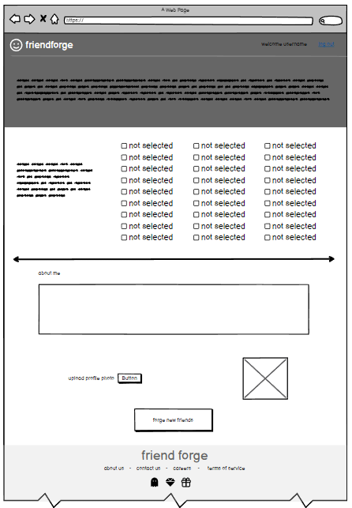

# GHI

# Landing Page

Our landing page includes options for users to sign up and create an account or to log in as an existing user.

# Sign Up

When a user chooses to sign up on the landing page, they are directed to a page where they are able to fill out their personal information to create their account.

# Forge

Users are able to join groups of a particular focus on the forge page.

# My Groups

Users are able to view a list of all groups they are part of.

# One Group

Users are able to view individual groups they belong to. On the group page, users can see other group members and chat with one another.

# Profile

Users can view their own profile and friends' profiles.
